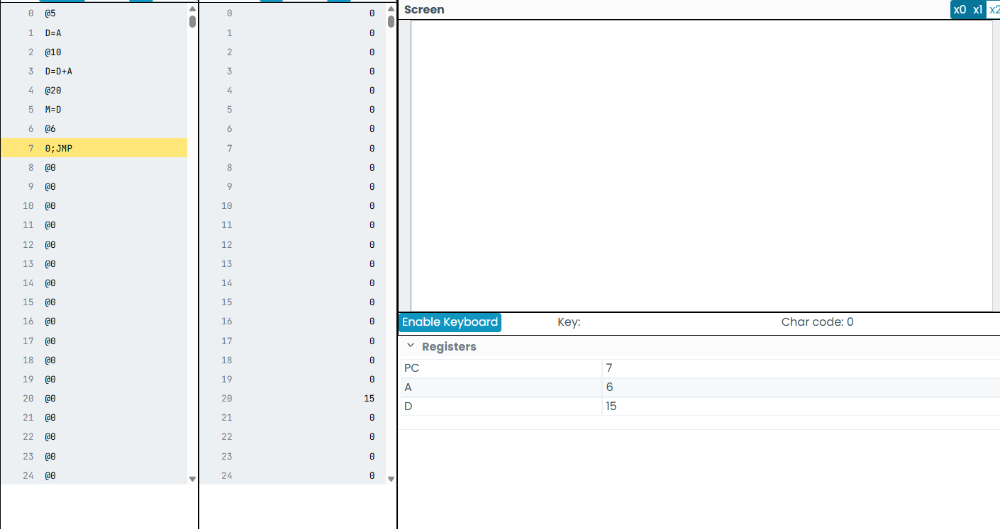
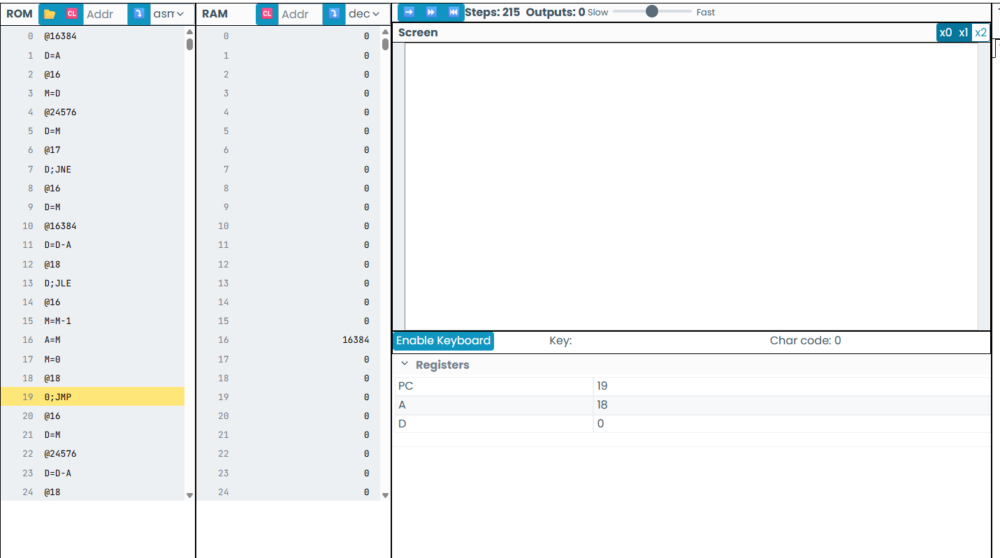
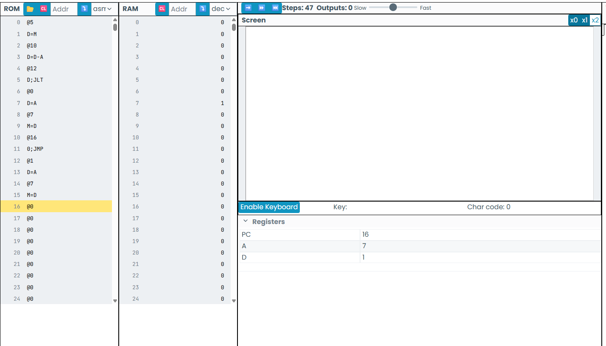
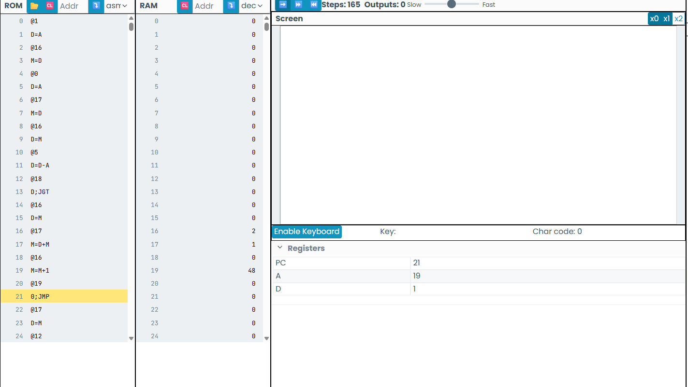
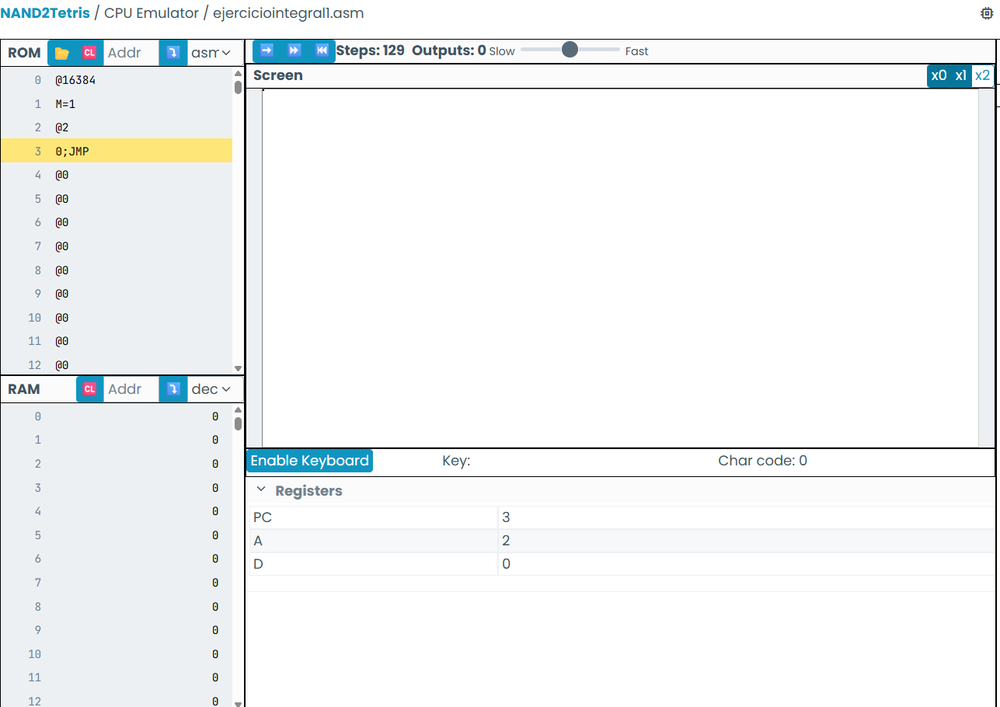
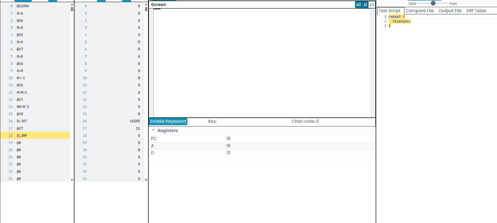
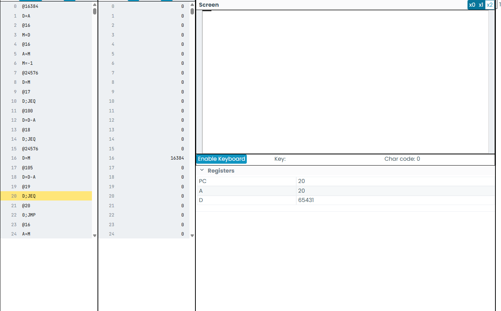

# Actividad 1
//Este programa toma los valores 1 y 2, los suma y guarda el resultado obtenido en la posición 16 de la memoria RAM.
Texto

# Actividad 2
//Escribe un programa en lenguaje ensamblador que sume los números 5 y 10, y almacene el resultado en la dirección de memoria 20. Utiliza el simulador de la CPU Hack para ejecutar tu programa y verifica que el resultado es correcto.
//¿Qué diferencia hay entre los datos almacenados en la memoria ROM y en la RAM?

//La memoria RAM almacena información de forma temporal mientras el equipo está en funcionamiento; al apagarlo, esos datos desaparecen. En cambio, la memoria ROM conserva información permanente necesaria para iniciar y operar el sistema.

Notas generales
//Copiar una constante al

@1954
D=A
@23
Al cargar @23, el registro A cambia a ese nuevo valor, pero el contenido que ya estaba almacenado en D permanece sin modificaciones.
D=D+A

@100
M=0
@17
D=A
@100
M=D

//RAM[100] <-- RAM[200]

@200
D=M

@100
M=D

//RAM[3] <-- RAM[3]-15

@15
D=A
@3
M=M-D

@4
D=M+1
@3
M=D

//if (D == 0) goto 300
//Condicionales

@300
D;JEQ

// if (RAM[3] < 100) goto 12
//RAM[3] = 60
//60 - 100 = -40
//120 - 100 = 20

@3
D=M
@100
D=D-A
@12
D;JLT

# Actividad 3
//Este programa verifica continuamente si se ha presionado una tecla. Para ello lee el contenido de la dirección del teclado (KBD) y guarda ese dato en el registro D para decidir qué acciones ejecutar.

//En este programa, la instrucción "M=M+1" corresponde a una operación realizada por la ALU, ya que incrementa en una unidad el valor almacenado en memoria.

//¿Para qué sirve el registro PC?
//El registro PC (Program Counter) almacena la dirección de memoria de la siguiente instrucción que debe ejecutar el procesador, permitiendo que el programa avance correctamente.

//¿Cuál es la diferencia entre @i y @READKEYBOARD?
//@i representa una variable utilizada para almacenar información durante la ejecución del programa, mientras que @READKEYBOARD es una etiqueta que marca una parte específica del código a la que el programa puede saltar.

//Describe qué se necesita para leer el teclado y mostrar información en la pantalla.
//Para leer el teclado se utiliza la dirección KBD, desde donde se obtiene el valor de la tecla presionada. Después, mediante las condiciones del programa y la memoria de pantalla (SCREEN), se actualizan los píxeles correspondientes para mostrar el resultado.

//Identifica un bucle en el programa y explica su funcionamiento.
//El ciclo formado por la etiqueta @READKEYBOARD y la instrucción "0;JMP" hace que el programa vuelva constantemente al mismo punto para revisar si el usuario ha presionado una tecla, manteniéndolo en ejecución de manera continua.

# Actividad 4

# Actividad 5

# Actividad integral

# Actividad integral 2

# Actividad integral 3

